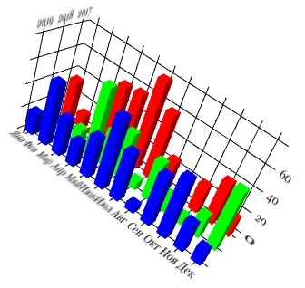

# 3D Bar Chart (using WebGL)

 

## Author

**Kirill Kupriyanov**

## Starting

* Install [Tomcat 8](https://tomcat.apache.org/download-80.cgi)

* Copy project folder into tomcat's webapps folder (for example c:\Tomcat\webapps\)

* Run tomcat server

* Main page http://127.0.0.1:8080/3dbarcharts/

* Jasmine js tests page http://127.0.0.1:8080/3dbarcharts/test.html?random=false

* For mocha js console testing:
- install [Node.js](https://nodejs.org)
- in project folder use:
```
npm install
```
```
npm test
```

* For rotating chart use 1 and 3 mouse buttons

## Configuring 3D bar chart

* Data files are located in ./data

* The configuration of each chart is set in file ./script/addTwoBarCharts.js and has the form of a json string:
```
example
{
    x: 0,
    y: 0,
    width: 4,
    height: 1,
    depth: 1,
    ledge: 0.2,
    animationSpeed: -0.02,
    axisTicksCount: 5,
    text: {
          size: 24,
          font: 'Georgia',
          color: '#000000',            
          width: 0.3,
          height: 0.3
    }            
}
```
x - chart position on the axis X
y - chart position on the axis Y
ledge - protrusion of the coordinate axes beyond the edges
animationSpeed - rotation speed
axisTicksCount - the number of tick marks on the coordinate axes
text - configuration of text on coordinate axes

* If you only want to see one chart or add more, edit the files index.html and ./script/addTwoBarCharts.js

## Note

* Class diagramm: ./diagram/3dbarcharts.png

* To support older versions of the browser copy the scripts from the folder:
- just copy scrypt from buid folder to script folder with replacement files
- or you can build scripts by your self:
 in project folder use:
```
npm install
```
```
npm run-script build
```
 and copy scrypt from buid folder to script folder with replacement files